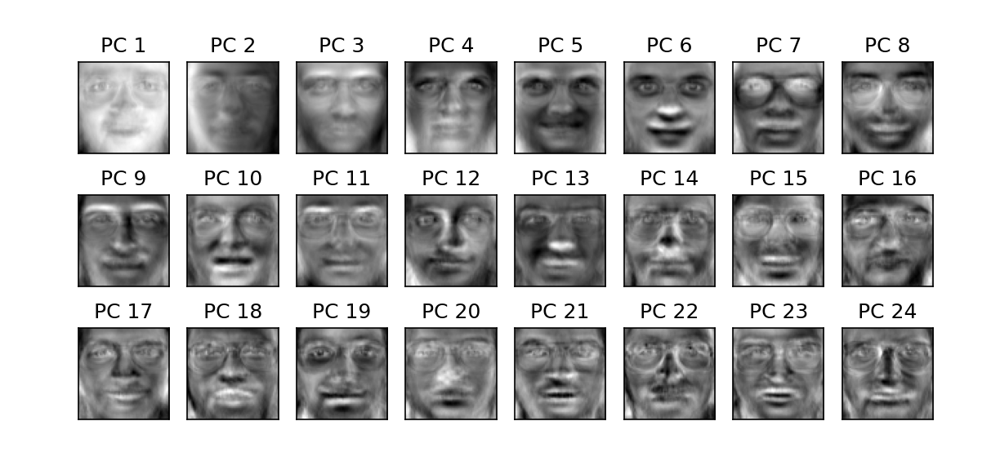

# Face Recognition Using PCA and SVM

## Overview

This project implements a face recognition system using Principal Component Analysis (PCA) for dimensionality reduction and a Support Vector Machine (SVM) classifier for classification. The dataset consists of face images represented as pixel values.

## Results

Reduced feature dimensions from 4096 to 200 while retaining significant variance. Achieved a classification precision score of 97%, recall of 96%, and F1-score of 96%. PCA efficiently finds a lower-dimensional space that preserves key facial variations for classification.

## Requirements

Ensure you have the following dependencies installed before running the script:

pip install numpy pandas matplotlib scikit-learn

## Dataset

The dataset (face_data.csv) contains face images in pixel form with an associated target label.

Each image is represented as a flattened array of pixel intensities (64x64 = 4096 features).

## Steps Performed
- Load and Visualize the Dataset
- Read face_data.csv into a Pandas DataFrame.
- Display the first few rows (optional).
- Extract target labels and pixel features.
- Show original grayscale face images.
- Preprocessing and Splitting Data
- Split the dataset into training (80%) and testing (20%) sets.
- Apply PCA for Dimensionality Reduction
- Fit PCA with 200 principal components.
- Plot the cumulative variance explained by each component.
- Display eigenfaces to visualize principal components.
- Train an SVM Classifier
- Transform training data using PCA.
- Train an SVM with an RBF kernel, C=1000, and gamma=0.01.
- Evaluate Model Performance
- Transform test data using PCA.
- Predict labels using the trained SVM.
- Print classification report (precision, recall, F1-score).

## Running the Script

Simply execute the Python script:

python face_recognition_pca.py
